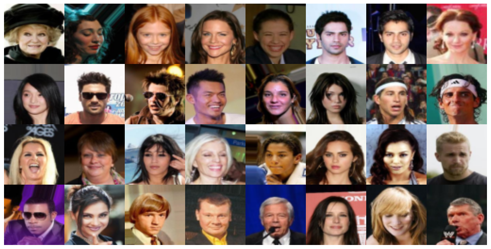
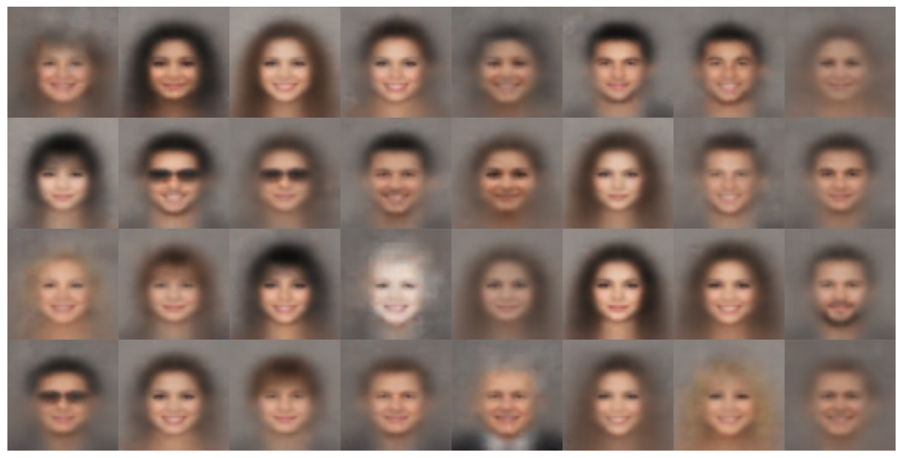
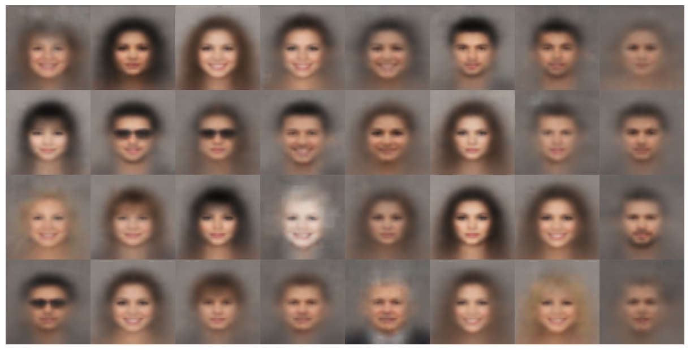
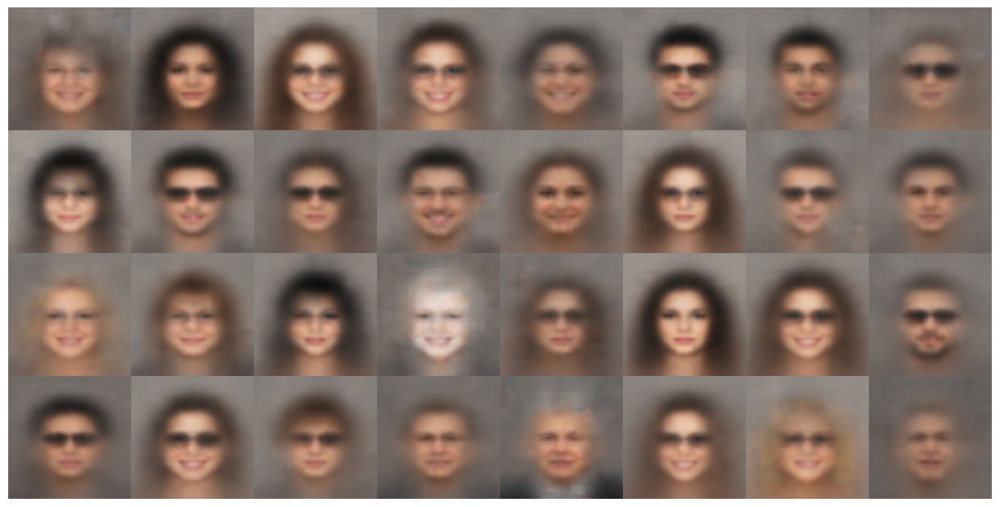

# Image-manipulation-CVAE

Conditional variational autoencoder (CVAE) is an extension of VAE developed in the field of
Neural machine translation. A blog on CVAE: [https://ijdykeman.github.io/ml/2016/12/21/cvae.html](https://ijdykeman.github.io/ml/2016/12/21/cvae.html)

## Dataset
CelebA dataset contains more than 200K celebrity images, each with 40 binary face attributes
annotations (like Male, Smiling, eye galsses etc.). Each image has its own face attributes
annotation, which is encoded as a 40-dimensional binary vector: 0 means that the image
does not show the corresponding attribute, 1 means that it does. The database can be
downloeaded using in-built functions in PyTorch/TensorFlow or can be downloaded from :
[https://mmlab.ie.cuhk.edu.hk/projects/CelebA.html]() (Download only AlignedCropped
Images and Attributes Annotations). Place **img_align_celeb.zip** inside [data](data) directory. 

## Image manipulation
- After training the model, select the attribute you want to modify and change the attribute list
- Encode the images using the pre-trained model encoder and store the resulting mean vectors
- Specify the desired new attributes changing the original labels
- Decode the mean vectors, combined with the new attribute labels, using the pre-trained model decoder

## Results
### Original image

### Non similing images to similing

### Non-mustached to Mustached

### Non-glass wearing to Glass wearing

(Note: Quality of the output images can be further improved by training a more comple CVAE)